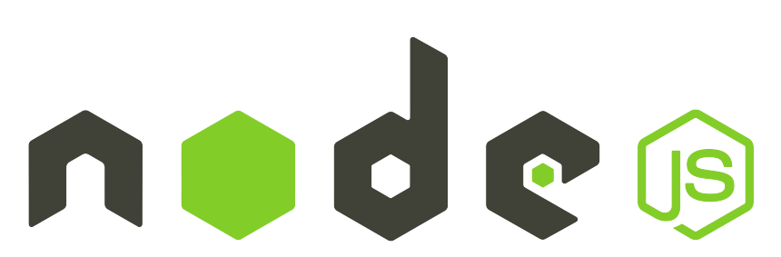
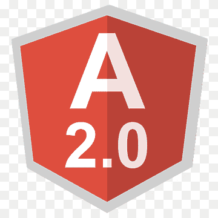

### 👋 Olá, Mundo! Eu sou Frank!

 

**Desenvolvedor Front-end**, gosto de café, música, jogos e sou muito curioso rs ! 🤟

Também gosto muito de tecnologia! <s>por essa você não esperava, não é mesmo?</s> Sempre fui fascinado pelo mundo do desenvolvimento de software e desde de então estudo freneticamente para conquistar meus objetivos. Fiz 1 ano de Estudos desde de que mudei pra SP a convite de meu cunhado que é senior na área..Atualmente continuo estudando rs,mas me sinto pronto e seguro para o mercado de trabalho.Sempre estive no meio da tecnologia e futuramente quero iniciar uma graduaçao na área. !

 

###  Tecnologias que estou apto a trabalhar 🚀

   &nbsp;
   &nbsp;
   &nbsp;
   &nbsp;
    &nbsp;
     &nbsp;
   &nbsp;
   &nbsp;
    &nbsp;
     &nbsp;
   &nbsp;
 

 
 

###  Tecnologias que estou estudando

 
Hoje me considero um desenvolvedor front end ,porém tenho interesse em aprofundar meus conhecimentos a me tornar um desenvolvedor fullstack por também se interessa pela área do  backEnd.
No momento atual meus estudos estão voltados  a melhorar minhas perfomances em consultas a APIS RestFull,testes unitários,Rxjs, Firebase para desenvolvimento de WebApps,apesar de está trabalhando em projetos pessoais,gostaria de estar a frente de projetos reais ..
Acredito que só com a mão na massa, trabalhando de fato, é que tudo se concretiza.

 

 
 

### Conecte-se comigo no Linkedin!

